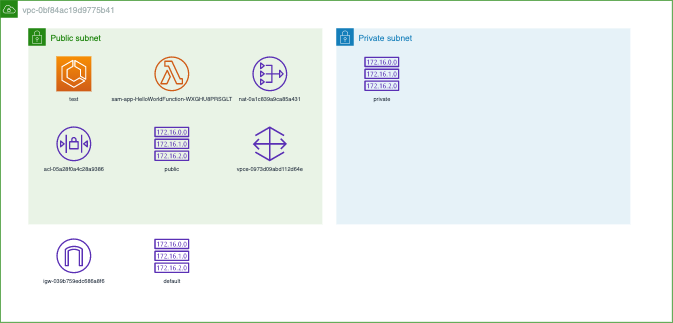
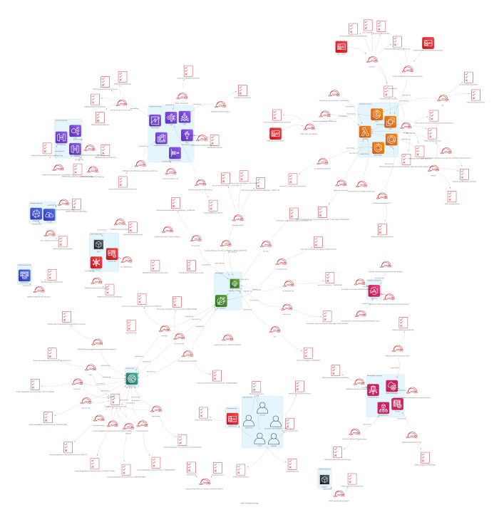

# Cloudiscovery

[](https://badge.fury.io/py/cloudiscovery)
[](https://pepy.tech/project/cloudiscovery)
[](https://codecov.io/gh/Cloud-Architects/cloudiscovery)

[](https://circleci.com/gh/Cloud-Architects/cloudiscovery)
[](https://www.codacy.com/gh/Cloud-Architects/cloudiscovery?utm_source=github.com&amp;utm_medium=referral&amp;utm_content=Cloud-Architects/cloudiscovery&amp;utm_campaign=Badge_Grade)
[](https://github.com/Cloud-Architects/cloudiscovery/blob/develop/LICENSE)


Cloudiscovery helps you to analyze resources in your cloud (AWS/GCP/Azure/Alibaba/IBM) account. Now this tool only can check resources in AWS, but we are working to expand to other providers.

The tool consists of various commands to help you understand the cloud infrastructure.

## Features

### Diagrams

Commands can generate diagrams. When modelling them, we try to follow the principle:

> Graphical excellence is that which gives to the viewer the greatest number of ideas in the shortest time with the least ink in the smallest space.

Edward Tufte

## Report

The commands generate reports that can be used to further analyze resources.

### CLI

1.  Run the cloudiscovery command with following options (if a region not pass, this script will try to get it from ~/.aws/credentials):

1.1 To detect AWS VPC resources (more on [AWS VPC](#aws-vpc)):

```sh
cloudiscovery aws-vpc [--vpc-id vpc-xxxxxxx] --region-name xx-xxxx-xxx [--profile-name profile] [--diagram [yes/no]] [--filter xxx] [--verbose]
```
1.2 To detect AWS policy resources (more on [AWS Policy](#aws-policy)):

```sh
cloudiscovery aws-policy [--profile-name profile] [--diagram [yes/no]] [--filter xxx] [--verbose]
```
1.3 To detect AWS IoT resources (more on [AWS IoT](#aws-iot)):

```sh
cloudiscovery aws-iot [--thing-name thing-xxxx] --region-name xx-xxxx-xxx [--profile-name profile] [--diagram [yes/no]] [--filter xxx] [--verbose]
```

1.4 To detect all AWS resources (more on [AWS All](#aws-all)):

```sh
cloudiscovery aws-all --region-name xx-xxxx-xxx [--profile-name profile] [--services xxx,xxx] [--filter xxx] [--verbose]
```

1.5 To check AWS limits per resource (more on [AWS Limit](#aws-limit)):

```sh
cloudiscovery aws-limit --region-name xx-xxxx-xxx [--profile-name profile] [--services xxx,xxx] [--usage 0-100] [--verbose]
```

2.  For help use:

```sh
cloudiscovery [aws-vpc|aws-policy|aws-iot|aws-all|aws-limit] -h
```

### Debbuging 

Enabling verbose mode, it is possible to debug all calls to the providers endpoints and check possible problems.

### Filtering

It's possible to filter resources by tags and resource type. To filter, add an option `--filter <VALUE>`, where `<VALUE>` can be:

1.  `Name=tags.costCenter;Value=20000` - to filter resources by a tag name `costCenter` and with value `20000`.
2.  `Name=type;Value=aws_lambda_function` to only list lambda functions.

It's possible to pass multiple values, to be able to select a value from a set. Values are split by `:` sign. If a desired value has a `:` sign, wrap it in `'` signs e.g. `--filter="Name=tags.costCenter;Value=20000:'20001:1'`.

It is possible to pass multiple filter options, just pass `-f filter_1 -f filter_2`. In that case, the tool will return resources that match either of the filters

Useful [CF tags](https://aws.amazon.com/blogs/devops/tracking-the-cost-of-your-aws-cloudformation-stack/):
1.  `aws:cloudformation:stack-name` - Stack name
2.  `aws:cloudformation:stack-id` - Stack id
3.  `aws:cloudformation:logical-id` - Logical id defined in CF template

## Requirements and Installation

### Installation

This tool has been written in Python3+ and AWS-CLI and it works on Linux, Windows and Mac OS.

Make sure the latest version of AWS-CLI is installed on your workstation, and other components needed, with Python pip already installed:

```sh
pip install -U cloudiscovery
```

### AWS Credentials

Make sure you have properly configured your AWS-CLI with a valid Access Key and Region:

```sh
aws configure
```

More on credentials configuration: [Configuration basics](https://docs.aws.amazon.com/cli/latest/userguide/cli-configure-quickstart.html)

#### AWS Permissions

The configured credentials must be associated to a user or role with proper permissions to do all checks. If you want to use a role with narrowed set of permissions just to perform cloud discovery, use a role from the following CF template shown below. To further increase security, you can add a block to check `aws:MultiFactorAuthPresent` condition in `AssumeRolePolicyDocument`. More on using IAM roles in the [configuration file](https://docs.aws.amazon.com/cli/latest/userguide/cli-configure-role.html).

```json
{
  "AWSTemplateFormatVersion": "2010-09-09",
  "Description": "Setups a role for diagram builder for all resources within an account",
  "Resources": {
    "cloudiscoveryRole": {
      "Type": "AWS::IAM::Role",
      "Properties": {
        "AssumeRolePolicyDocument" : {
          "Statement" : [
            {
              "Effect" : "Allow",
              "Principal" : {
                "AWS": { "Fn::Join" : [ "", [
                  "arn:aws:iam::", { "Ref" : "AWS::AccountId" }, ":root"
                ]]}
              },
              "Action" : [ "sts:AssumeRole" ]
            }
          ]
        },
        "Policies": [{
          "PolicyName": "additional-permissions",
          "PolicyDocument": {
            "Version": "2012-10-17",
            "Statement" : [
              {
                "Effect" : "Allow",
                "Action" : [
                  "kafka:ListClusters",
                  "synthetics:DescribeCanaries",
                  "medialive:ListInputs",
                  "cloudhsm:DescribeClusters",
                  "ssm:GetParametersByPath",
                  "servicequotas:Get*",
                  "amplify:ListApps",
                  "autoscaling-plans:DescribeScalingPlans",
                  "medialive:ListChannels",
                  "medialive:ListInputDevices",
                  "mediapackage:ListChannels",
                  "qldb:ListLedgers",
                  "transcribe:ListVocabularies",
                  "glue:GetDatabases",
                  "glue:GetUserDefinedFunctions",
                  "glue:GetSecurityConfigurations",
                  "glue:GetTriggers",
                  "glue:GetCrawlers",
                  "glue:ListWorkflows",
                  "glue:ListMLTransforms",
                  "codeguru-reviewer:ListCodeReviews",
                  "servicediscovery:ListNamespaces",
                  "apigateway:GET"
                ],
                "Resource": [ "*" ]
              }
            ]
          }
        }],
        "Path" : "/",
        "ManagedPolicyArns" : [
          "arn:aws:iam::aws:policy/job-function/ViewOnlyAccess",
          "arn:aws:iam::aws:policy/SecurityAudit"
        ]
      }
    }
  },
  "Outputs" : {
    "cloudiscoveryRoleArn" : {
      "Value" : { "Fn::GetAtt": [ "cloudiscoveryRole", "Arn" ]}
    }
  }
}
```

(Optional) If you want to be able to switch between multiple AWS credentials and settings, you can configure [named profiles](https://docs.aws.amazon.com/cli/latest/userguide/cli-configure-profiles.html) and later pass profile name when running the tool.

## Commands

### AWS VPC

Example of a diagram:



Following resources are checked in VPC command:

*   Autoscaling Group
*   Classic/Network/Application Load Balancer
*   Client VPN Endpoints
*   CloudHSM
*   DocumentDB
*   Directory Service
*   EC2 Instance
*   ECS
*   EFS
*   ElastiCache
*   Elasticsearch
*   EKS
*   EMR 
*   IAM Policy
*   Internet Gateway (IGW)
*   Lambda
*   Media Connect
*   Media Live
*   Media Store Policy
*   MSK
*   NACL
*   NAT Gateway
*   Neptune
*   QuickSight
*   RDS
*   REST Api Policy
*   Route Table
*   S3 Policy
*   Sagemaker Notebook
*   Sagemaker Training Job
*   Sagemaker Model
*   Security Group
*   SQS Queue Policy
*   Site-to-Site VPN Connections
*   Subnet
*   Synthetic Canary
*   VPC Peering
*   VPC Endpoint
*   VPN Customer Gateways
*   Virtual Private Gateways
*   Workspace

The subnets are aggregated to simplify the diagram and hide infrastructure redundancies. There can be two types of subnet aggregates:
1.  Private*   ones with a route `0.0.0.0/0` to Internet Gateway
2.  Public*   ones without any route to IGW

If EC2 instances and ECS instances are part of an autoscaling group, those instances will be aggregated on a diagram.

### AWS Policy

Example of a diagram:



Following resources are checked in Policy command:

*   [AWS Principal](https://gist.github.com/shortjared/4c1e3fe52bdfa47522cfe5b41e5d6f22) that are able to assume roles
*   IAM Group
*   IAM Group to policy relationship
*   IAM Policy
*   IAM Role
*   IAM Role to policy relationship
*   IAM User
*   IAM User to group relationship
*   IAM User to policy relationship

Some roles can be aggregated to simplify the diagram. If a role is associated with a principal and is not attached to any named policy, will be aggregated.

### AWS IoT

Example of a diagram:


Following resources are checked in IoT command:

*   IoT Billing Group
*   IoT Certificates
*   IoT Jobs
*   IoT Policies
*   IoT Thing
*   IoT Thing Type

### AWS All

A command to list **ALL** AWS resources. 

The command calls all AWS services (200+) and operations with name `Describe`, `Get...` and `List...` (500+).

The operations must be allowed to be called by permissions described in [AWS Permissions](#aws-permissions).

Types of resources mostly cover Terraform types. It is possible to narrow down scope of the resources to ones related with a given service with parameter `-s` e.g. `-s ec2,ecs,cloudfront,rds`.

### AWS Limit

It's possible to check resources limits  across various service in an account. This command implements over 60 limits checks.

With `--services value,value,value` parameter, you can narrow down checks to just services that you want to check. 

With `--threshold 0-100` option, you can customize a minimum percentage threshold to start reporting a warning.

*   Services available
    *   Acm
    *   Amplify
    *   Apigateway
    *   Appmesh
    *   Appsync
    *   Autoscaling Plans
    *   Batch
    *   Chime
    *   Codebuild
    *   Codecommit
    *   Codeguru Reviewer
    *   Codeguru Profiler
    *   Cognito Federated Identities
    *   Cloudformation
    *   Cloud Map
    *   CloudWatch Logs
    *   Dynamodb
    *   EC2
    *   ECR
    *   ECS
    *   Elastic Inference
    *   Elastic Filesystem
    *   Elastic Beanstalk
    *   Elastic Loadbalancing
    *   Forecast
    *   Fraud Detector
    *   Gamelift
    *   Glue
    *   IAM
    *   Inspector
    *   Kendra
    *   KMS
    *   Media Connect
    *   Media Live
    *   Media Package
    *   Metwork Manager
    *   Polly
    *   Qldb
    *   Robomaker
    *   Route53
    *   Route53resolver
    *   RDS
    *   S3
    *   SNS
    *   SWF
    *   Transcribe
    *   Translate
    *   VPC

AWS has a default quota to all services. At the first time that an account is created, AWS apply this default quota to all services.  
An administrator can ask to increase the quota value of a certain service via ticket. This command helps administrators detect those issues in advance.

More information: [AWS WA, REL 1 How do you manage service limits?](https://wa.aws.amazon.com/wat.question.REL_1.en.html)

## Using a Docker container

To build docker container using Dockerfile

```sh
docker build -t cloudiscovery .
```

After build container, you must start container using follow command. The run command will mount a filesystem with your actual aws cli credentials, then you won't need configure aws cli again.

```sh
docker run \
-it \
--mount type=bind,source=$HOME/.aws/,target=/root/.aws/,readonly \
cloudiscovery \
/bin/bash

```

*   If you are using Diagram output and due to fact container is a slim image of Python image, you must run cloudiscovery with "--diagram no", otherwise you'll have an error about "xdg-open". The output file will be saved in "assets/diagrams".

## Translate

This project support English and Portuguese (Brazil) languages. To contribute with a translation, follow this steps:

*   Create a folder inside locales folder with prefix of new idiom with appropiate [locale code](https://docs.oracle.com/cd/E23824_01/html/E26033/glset.html). Copy "locales/messages.pot" to locales/newfolder/LC_MESSAGES/.
*   To build ".mo" file running this command from project root folder:

```sh
python msgfmt.py -o locales/NEWFOLDER/LC_MESSAGES/messages.mo locales/NEWFOLDER/LC_MESSAGES/messages
```

## Contributing

If you have improvements or fixes, we would love to have your contributions. Please use [PEP 8](https://pycodestyle.readthedocs.io/en/latest/) code style.

## Development

When developing, it's recommended to use [venv](https://docs.python.org/3/library/venv.html).

In order to create a venv on macOS and Linux:
```sh
python3 -m venv env
```
On Windows:
```sh
py -m venv venv
OR
python -v venv venv
```
Once installed, you need to activate the virtual environment. Activation will put specific paths for `python` and `pip` commands.
On macOS and Linux call:
```sh
source venv/bin/activate
```
On Windows:
```sh
.\venv\Scripts\activate
```

Make sure you have installed [pre-commit](https://pre-commit.com/#installation).

Install development requirements:
```sh
pip install -U -r requirements.txt -r requirements-dev.txt
```

Add precommit hooks:
```sh
pre-commit install
```

To run pre-commit hooks, you can issue the following command:
```sh
pre-commit run --all-files
```

To add new resources to check limit, please remove "assets/.cache/cache.db"

## Making a release

1.  Update the version in cloudiscovery/__init\__.py and create a new git tag with `git tag $VERSION`.
2.  Once you push the tag to GitHub with `git push --tags`, a new CircleCI build is triggered.

## Similar projects and products

*   [mingrammer/diagrams](https://github.com/mingrammer/diagrams) - library being used to draw diagrams
*   [Lucidchart Cloud Insights](https://www.lucidchart.com/pages/solutions/cloud-insights) - commercial extension to Lucidchart
*   [Cloudcraft](https://cloudcraft.co) - commercial visualization tool